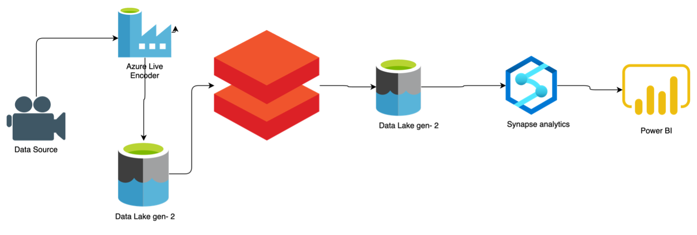

# Tokyo_olympic-Azure-Data-Engineering-Project

## Introduction 
You will use Azure Services to carry out an end-to-end data engineering effort on Tokyo Olympics data in this project.

We will use a variety of technologies, including Azure Data Factory, Azure Data Lake Gen-2, Azure DataBricks, ADLS-2, Azure Synapse analytics, and Dashboard-Power BI.

## Architecture 

## Technology Used
- Azure.
1. Azure Data Factory
2. Data Lake Gen-2
3. Azure Databricks
4. Data Lake Gen-2
5. Synapse Analytics
6. Power BI

#Data Extraction with Azure Data Factory (ADF):

Gathering data related to the Tokyo Olympics from Kaggle.
Using Azure Data Factory (ADF), a cloud-based data integration service, you created a data pipeline to extract the raw data from the source (Kaggle) and store it in Azure Data Lake Storage Gen2 (ADLS-2). This raw data includes information about Athletes, Coaches, Entres Gender, Medals and Teams.

# Data Transformation with Azure Databricks:
Next, you utilized Azure Databricks, a cloud-based Apache Spark platform, for data transformation tasks.
In Azure Databricks, you performed various transformations on the raw data to clean, filter, aggregate, or enrich it as needed.
These transformations helped prepare the data for further analysis and reporting.

# Data Loading into Refined Data Store (ADLS-2):
After transforming the data in Azure Databricks, you loaded the refined data back into Azure Data Lake Storage Gen2 (ADLS-2).
This refined data represents a cleaned and processed version of the original raw data, making it more suitable for analysis and reporting.

# Data Querying with Azure Synapse Analytics:

Utilizing Azure Synapse Analytics, a cloud-based analytics service, you performed querying and analysis on the refined data stored in ADLS-2.
Azure Synapse Analytics provides a unified analytics platform for both big data and data warehousing workloads, enabling you to run complex SQL queries and gain insights from your data.

#Reporting with Power BI:

Finally, you created reports and visualizations using Power BI, a business analytics tool.
Power BI allows you to connect to various data sources, including Azure Synapse Analytics, and build interactive dashboards and reports to visualize the insights derived from your data.
These reports help stakeholders, such as sports analysts or Olympic committee members, to understand trends, performance, and other key metrics related to the Tokyo Olympics

## Dataset Used
You can use any dataset, we are mainly interested in operation side of Data Engineering.
